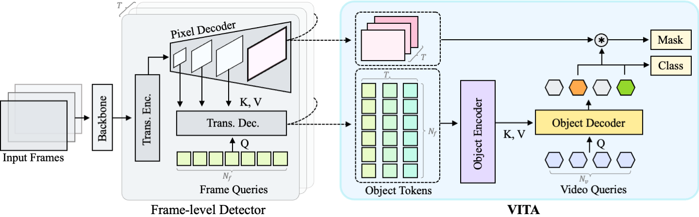

# VITA: Video Instance Segmentation via Object Token Association (NeurIPS 2022)
[](https://paperswithcode.com/sota/video-instance-segmentation-on-youtube-vis-1?p=vita-video-instance-segmentation-via-object)  
[](https://paperswithcode.com/sota/video-instance-segmentation-on-youtube-vis-2?p=vita-video-instance-segmentation-via-object)  
[](https://paperswithcode.com/sota/video-instance-segmentation-on-ovis-1?p=vita-video-instance-segmentation-via-object)

[Miran Heo<sup>*](https://sites.google.com/view/miranheo), [Sukjun Hwang<sup>*](https://sukjunhwang.github.io), [Seoung Wug Oh](https://sites.google.com/view/seoungwugoh), [Joon-Young Lee](https://joonyoung-cv.github.io), [Seon Joo Kim](https://sites.google.com/site/seonjookim/home) (*equal contribution)

[[`arXiv`](https://arxiv.org/abs/2206.04403)] [[`BibTeX`](#CitingVITA)]

<div align="center">
  
</div><br/>

## Updates
* **`Jan 20, 2023`:** Our new online VIS method "GenVIS" is available at [here](https://github.com/miranheo/GenVIS)!
* **`Sep 14, 2022`:** VITA is accepted to NeurIPS 2022!
* **`Aug 15, 2022`:** Code and pretrained weights are now available! Thanks for your patience :)

## Installation

See [installation instructions](INSTALL.md).

## Getting Started

We provide a script `train_net_vita.py`, that is made to train all the configs provided in VITA.

To train a model with "train_net_vita.py" on VIS, first
setup the corresponding datasets following
[Preparing Datasets for VITA](./datasets/README.md).

Then run with COCO pretrained weights in the Model Zoo:
```
python train_net_vita.py --num-gpus 8 \
  --config-file configs/youtubevis_2019/vita_R50_bs8.yaml \
  MODEL.WEIGHTS vita_r50_coco.pth
```

To evaluate a model's performance, use
```
python train_net_vita.py \
  --config-file configs/youtubevis_2019/vita_R50_bs8.yaml \
  --eval-only MODEL.WEIGHTS /path/to/checkpoint_file
```

## <a name="ModelZoo"></a>Model Zoo

### Pretrained weights on COCO
| Name | R-50  | R-101 | Swin-L |
| :---: | :---: | :---: | :---: |
| VITA | [model](https://drive.google.com/file/d/1bCkxJreuOOO5Dw77PNnE8oeGaykikDW1/view?usp=share_link) | [model](https://drive.google.com/file/d/1I9GyLk8did3A3pgD7FSG9k1fYd8tgFJJ/view?usp=share_link) | [model](https://drive.google.com/file/d/1AkP5LHQfRxFltAbDVWlLPkylEIRsdSwm/view?usp=share_link) |

### YouTubeVIS-2019
| Name | Backbone | AP | AP50 | AP75| AR1 | AR10 | Download |
| :---: | :---: | :---: | :---: | :---: | :---: | :---: | :---: |
| VITA | R-50 | 49.8 | 72.6 | 54.5 | 49.4 | 61.0 | [model](https://drive.google.com/file/d/11bJlEGEzjWNqX_Z57Z812F0vBbKDSSP7/view?usp=share_link) |
| VITA | Swin-L | 63.0 | 86.9 | 67.9 | 56.3 | 68.1 | [model](https://drive.google.com/file/d/1w9qEH_JRBtBlbeeOC3bVrxyYarwWkBfF/view?usp=share_link) |

### YouTubeVIS-2021
| Name | Backbone | AP | AP50 | AP75| AR1 | AR10 | Download |
| :---: | :---: | :---: | :---: | :---: | :---: | :---: | :---: |
| VITA | R-50 | 45.7 | 67.4 | 49.5 | 40.9 | 53.6 | [model](https://drive.google.com/file/d/17HJtaiBGCJu4xKMfwkvZ_YNJg5j2cOl0/view?usp=share_link) |
| VITA | Swin-L | 57.5 | 80.6 | 61.0 | 47.7 | 62.6 | [model](https://drive.google.com/file/d/1zwzFBtqX9DkWHric8TRveGTUBWk-Ix0G/view?usp=share_link) |

### OVIS
| Name | Backbone | AP | AP50 | AP75| AR1 | AR10 | Download |
| :---: | :---: | :---: | :---: | :---: | :---: | :---: | :---: |
| VITA | R-50 | 19.6 | 41.2 | 17.4 | 11.7 | 26.0 | [model](https://drive.google.com/file/d/1BHx5rRTKqtsQSuHOeCShEzxjpb1aLJ4t/view?usp=share_link) |
| VITA | Swin-L | 27.7 | 51.9 | 24.9 | 14.9 | 33.0 | [model](https://drive.google.com/file/d/1AmpmjNwPHRoYs0HOIKNrNv6FNUKBUi2Y/view?usp=share_link) |

## License
The majority of VITA is licensed under a
[Apache-2.0 License](LICENSE).
However portions of the project are available under separate license terms: Detectron2([Apache-2.0 License](https://github.com/facebookresearch/detectron2/blob/main/LICENSE)), IFC([Apache-2.0 License](https://github.com/sukjunhwang/IFC/blob/master/LICENSE)), Mask2Former([MIT License](https://github.com/facebookresearch/Mask2Former/blob/main/LICENSE)), and Deformable-DETR([Apache-2.0 License](https://github.com/fundamentalvision/Deformable-DETR/blob/main/LICENSE)).

## <a name="CitingVITA"></a>Citing VITA

If you use VITA in your research or wish to refer to the baseline results published in the Model Zoo, please use the following BibTeX entry.

```BibTeX
@inproceedings{VITA,
  title={VITA: Video Instance Segmentation via Object Token Association},
  author={Heo, Miran and Hwang, Sukjun and Oh, Seoung Wug and Lee, Joon-Young and Kim, Seon Joo},
  booktitle={Advances in Neural Information Processing Systems},
  year={2022}
}
```

## Acknowledgement

Our code is largely based on [Detectron2](https://github.com/facebookresearch/detectron2), [IFC](https://github.com/sukjunhwang/IFC), [Mask2Former](https://github.com/facebookresearch/MaskFormer), and [Deformable DETR](https://github.com/fundamentalvision/Deformable-DETR). We are truly grateful for their excellent work.
